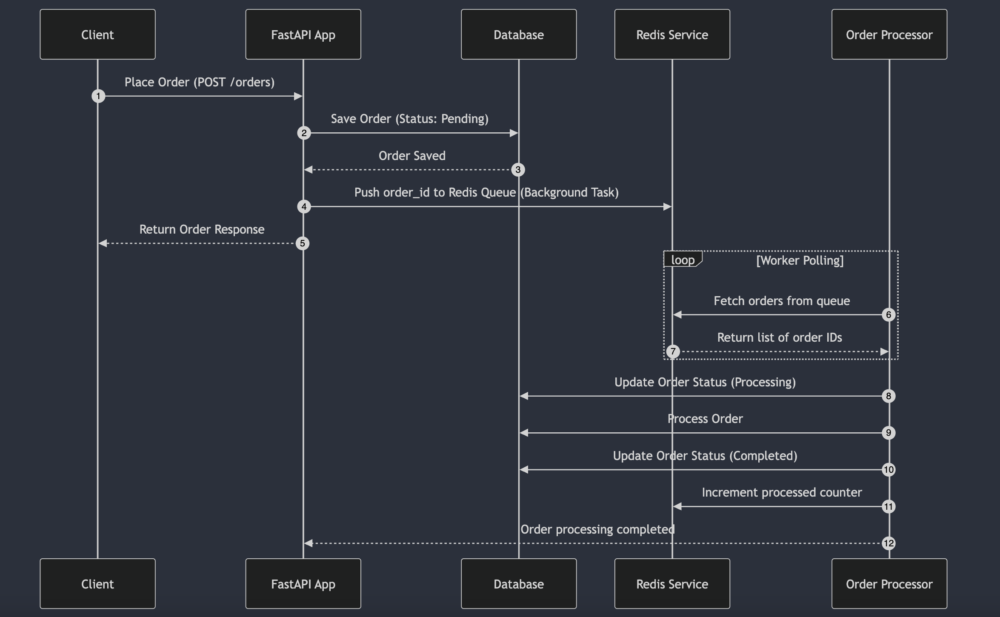

# UPDATE

```sh
My Public IP is changed to http://13.49.181.224/
Please use this
```

# Setup Instructions

## 1. Create a Virtual Environment and Install Requirements

```sh
python3 -m venv venv
source venv/bin/activate
pip install -r requirements.txt
```

## 2. Setup Redis

### Install Redis

#### For Linux:

```sh
sudo apt install redis-server
```

#### For macOS:

```sh
brew install redis
```

### Run Redis Server

```sh
redis-server --port 6000 --daemonize yes
```

## 3. Configure Environment Variables

Add a `.env` file inside `app/core/` and specify the `DB_PATH`. Example:

```sh
DB_PATH=/Users/vinit.kumar/order-process-system/test.db
```

## 4. Pre-Populate Database

Run the script to pre-populate data:

```sh
python pre_populate_script.py
```

## 5. Start the Server

```sh
uvicorn app.main:app --reload
```

## 6. Import Postman Collection

Import the provided Postman collection and start testing your API. 🚀

### Postman Collection Explanation

The Postman collection includes the following API requests:

#### 1. Create an Order (POST `/orders/`)

- **Request:**
  ```json
  {
    "user_id": "user123",
    "item_ids": ["item1", "item2"],
    "total_amount": 99.99
  }
  ```
- **Response:**
  ```json
  {
      "total_amount": 999.99,
      "user_id": "201a8e4a-c775-4266-a151-9db20b786f2d",
      "completed_at": null,
      "updated_at": "2025-03-01T10:11:47.509155",
      "order_id": "ORD-f7037b2d6cb34e36a998594426a8ec67",
      "status": "pending",
      "created_at": "2025-03-01T10:11:47.509153"
  }
  ```
- **Endpoints:**
  - `http://localhost:8000/orders/` (Localhost)
  - `http://51.20.56.95:8000/orders/` (AWS Server)

#### 2. Get Order Status (GET `/orders/{order_id}`)

- **Request:**
  ```sh
  GET http://localhost:8000/orders/ORD-f7037b2d6cb34e36a998594426a8ec67
  ```
- **Response:**
  ```json
  {
    "order_id": "ORD-f7037b2d6cb34e36a998594426a8ec67",
    "status": "completed",
    "created_at": "2025-03-01T02:22:33.831868",
    "user_id": "201a8e4a-c775-4266-a151-9db20b786f2d",
    "total_amount": 999.99,
    "completed_at": "2025-03-01T02:22:34.062146",
    "updated_at": "2025-03-01T02:22:34.081146"
  }
  ```

#### 3. Get System Metrics (GET `/orders/metrics`)

- **Request:**
  ```sh
  GET http://localhost:8000/orders/metrics
  ```
- **Response:**
  ```json
  {
    "average_processing_time_seconds": 0,
    "order_status_counts": {
        "pending": 6,
        "processing": 4,
        "completed": 7765
    }
  }
  ```

#### 4. Get Orders Status in Queue (GET `/orders/status/`)

- **Request:**
  ```sh
  GET http://localhost:8000/orders/status/
  ```

This collection allows you to test order creation, order status retrieval, system metrics, and queue status. 🚀

# Sequence Diagram



# Scalable Order Processing System

## 🚀 Overview

This is a highly scalable order-processing system designed to handle **1000+ concurrent orders** efficiently. It utilizes **FastAPI, SQLite, Redis, and Custom Worker Processes** to process orders asynchronously and update order statuses dynamically.

## 🏗️ Architecture Design

### 📌 System Workflow

1️⃣ **Order Creation API (FastAPI)**

- Accepts `user_id`, `item_ids`, and `total_amount`.
- Stores order **in SQLite** (initially **PENDING** state).
- Pushes `order_id` to **Redis queue** for background processing.
- Returns order details instantly after inserting it in DB.

2️⃣ **Redis Queue**

- Acts as a **message broker**.
- Stores orders in **FIFO order** using `RPUSH`/`LPOP`.
- Orders are consumed by background workers.

3️⃣ **Custom Worker Process**

- Fetches `order_id` from Redis queue.
- Updates order **status → PROCESSING**.
- Simulates order processing (e.g., payment verification, stock check).
- Implements **failure handling and retries** using exponential backoff.
- Updates order **status → COMPLETED** in the database.
- Updates Redis with **order metrics** (total orders processed, avg time, etc.).

4️⃣ **Metrics API (FastAPI)**

- Fetches key insights:
  - **Total orders processed**.
  - **Average processing time**.
  - **Orders count per status (PENDING, PROCESSING, COMPLETED)**.
  - **Queue length and pending orders in Redis**.

## 📊 Database Schema Design

### Users Table
| Column  | Type      | Description         |
|---------|----------|---------------------|
| id      | TEXT (PK)| Unique user ID      |
| name    | TEXT     | User name           |
| email   | TEXT     | Unique user email   |
| is_active | BOOLEAN | Active status       |

### Items Table
| Column  | Type      | Description         |
|---------|----------|---------------------|
| id      | TEXT (PK)| Unique item ID      |
| name    | TEXT     | Item name           |
| description | TEXT | Item description    |
| price   | FLOAT    | Item price          |
| is_active | BOOLEAN | Active status      |

### Orders Table
| Column         | Type          | Description                        |
|---------------|--------------|------------------------------------|
| order_id      | TEXT (PK)     | Unique order identifier           |
| user_id       | TEXT (FK → users.id) | User who placed the order         |
| total_amount  | FLOAT         | Total order amount                |
| status        | TEXT          | Order status (pending, processing, completed) |
| created_at    | DATETIME      | Order creation timestamp          |
| updated_at    | DATETIME      | Last update timestamp             |
| completed_at  | DATETIME NULL | Completion timestamp (if completed) |

### Order Items Table (Many-to-Many Relationship)
| Column    | Type          | Description                        |
|----------|--------------|------------------------------------|
| order_id | TEXT (FK → orders.order_id) | Associated order |
| item_id  | TEXT (FK → items.id) | Associated item |
| quantity | INTEGER       | Quantity ordered |
| price_at_time | FLOAT | Price at the time of order |

## 🚀 Load Testing

A **Locust-based load testing script** is available in the `load_testing` folder. Use it to simulate high traffic and measure system performance.

```sh
cd load_testing
locust -f locustfile.py
```

